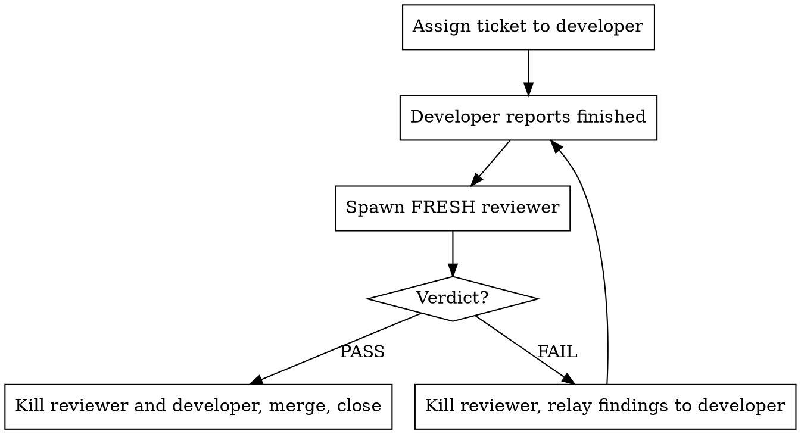

# Dev Team

## Overview

You are the **team lead**. You do not write code, run the build, or judge the
work. You assign tickets to developer teammates, and when a developer says it
is finished you spin up a **fresh** reviewer to tear the work apart. The loop
ends only when a reviewer says PASS.

**Core principle: the lead never declares work done. Only a reviewer does.**

**The review is technical here, and it is on a leash.** Udea is an engine.
Most of this backlog is codegen, KSP processors, replication contracts,
determinism and module graph work - tickets with nothing to photograph and
nothing a player would ever see. A reviewer that only looked at pictures would
have nothing to look at. So the Udea reviewer **does** open the diff.

What stops that becoming a nitpick spiral is that its reject list is **closed**.
`docs/engineering-standards.md` section 8 and the "Do not" list in `AGENTS.md`
are the whole of it, enumerated in the reviewer contract below. A reviewer may
fail a branch on an item in that list, on a missing or broken evidence command,
or on an acceptance criterion with no proof. It may not fail a branch on
anything else - not a KDoc that counts wrong, not naming taste, not a heading
above four bullets. Those go under out-of-scope and the branch ships.

That leash is not a courtesy. The sister project this process came from ran
#247 for six rounds and eighteen findings, every one of them a comment, on a
page that worked correctly from round 1; another ticket reached round 11 the
same way. The rules below are built to keep a ticket at one or two rounds.

## Nobody is watching - decide it yourself

This runs on a remote box with the owner away. **Never ask the user a question.**
Not the lead, not a developer, not a reviewer. A question does not pause the
work for a minute, it stalls the ticket until somebody happens to look, and the
answer arrives long after the context that needed it is gone. `AskUserQuestion`
is off the table for the whole run.

So decide. The issue text is the authority; where it is silent, take the reading
a careful colleague would take and keep going. Where a choice is irreversible
and a reversible option exists, take the reversible one - it is the version the
user can still overturn when they read it.

**Then write the decision down where they will find it**, as a comment on the
issue it belongs to:

```
gh issue comment <N> --body '...'
```

One comment per decision, and it must contain: what was decided, what the
alternative was, why this one, and what to change if the user disagrees. That
last part is what makes it reviewable rather than a notification - a comment
saying "I chose A" is worth nothing to somebody deciding whether A was right.

Every question the run produces ends up in one of two places: a comment on the
issue, or a new issue of its own. Never in a message that waits for a reply, and
never dropped because the run finished before anyone answered.

Two things this project makes tempting to ask about, and you must not:

| Question you wanted to ask | What to do instead |
|---|---|
| "Should `example` merge into `master`?" | **No.** That is the one decision `HANDOFF.md` explicitly reserves for the owner. Work on `example`, merge to `example`, push `example`. Leave `master` alone. |
| "This needs a frozen contract changed" | Stop the ticket and say so. `docs/contracts/` is frozen; `AGENTS.md` says frozen means frozen. File an issue describing the change and what it would break, and take a different ticket. |
| "Is this out of scope?" | It is. File it as its own issue and carry on |
| "Which of these two designs?" | Pick the one the issue text supports, comment the other |
| "Should I merge this?" | A reviewer's PASS is the sign-off. Merge it. |

Report to the user at the end regardless - they read it when they return. The
rule is that nothing *waits* on them.

## Where the work lands

**The integration branch is `example`, not `master`.**

`master` is at `ce7db67`. `example` carries all of Phase 7 - `udea-replay`, the
determinism verifier, the CI workflow, the lane economy - plus everything every
wave since has merged. It moves; read `git log --oneline -1 example` rather than
trusting a SHA written here.
`HANDOFF.md` says merging `example` into `master` "is a decision somebody should
make deliberately rather than find already made", and it is the owner's to make.
So: developers branch from `origin/example`, you merge into `example`, and you
push `origin example`. Nothing this team does touches `master`.

Read `.claude/WAVE.md` first and `HANDOFF.md` second. `HANDOFF.md` names what is
red (`:moba:runUdpProof` under loss) and what is built but not installed
(`MobaPhysicsModule`), but its Phase 7 section is **out of date**: the cross-OS
`replay-equality` job shipped at `a1d5217` (#152). What Phase 7 still owes is a
real Actions run, #165's nightly fixture, and pointing the gate at `moba`.
`WAVE.md` is the last lead's handoff and it supersedes `HANDOFF.md` wherever the
two disagree.

## Roles

| Role | Who | Writes code | Ends the loop |
|---|---|---|---|
| Lead | you, the main thread | no | no |
| Developer | `engineer` agent, one per ticket, long-lived | yes | no |
| Reviewer | `reviewer` agent, **new one every round**, killed after | no | yes (PASS) |

The reviewer reads three things: the diff, `BRIEF.md`, and whatever the evidence
command left behind. It does not drive the game by hand and it does not go
looking for a second way to check.

Developers and reviewers are **in-process background subagents**, not
pane-backed teammates - a session launched with `--bg` has no terminal to split,
and named `Agent` spawns stay in-process. The user therefore cannot watch them
work. Their only windows into the run are the screenshot gallery, the agent
dashboard and your relays, which is why the image rule below is not optional and
why you relay findings verbatim rather than summarising them.

**Why a fresh reviewer each round:** a reviewer that already argued for a
finding is invested in it, and a reviewer that already approved a file skims it
next time. Round 2 gets a reviewer that has never seen the branch.

## The Loop



### 1. Pick tickets

`gh issue list` unless the user named one. Read the body **and the comments**
with `gh issue view N` and paste the body verbatim into the dispatch prompt.

**This backlog is stale, and it will lie to you.** Issues #147, #148, #149,
#150, #151 are open and describe `udea-replay`, the deterministic replay and
the determinism scanner - all of which **shipped** on `example` at `8035374`.
A ticket left open is not evidence that the work is outstanding. Before you
dispatch, grep the tree for the thing the ticket names - the module, the task
name, the class - and if you find it, read it before assuming it is unrelated.

Where the work IS already there, the ticket is rarely empty: it usually still
holds the decision nobody ruled on and the cases nothing covers. Redirect the
developer to those rather than cancelling it, and say plainly in the dispatch
that the implementation exists so it does not write a second one.

**What you dispatch is the wave, and the wave is closed once you have
dispatched it.** When one developer finishes and a slot frees, do not put
another ticket into it - that one belongs to the next wave, after the reset.
Refilling the slot the instant it empties means nothing is ever quiet, so the
reset boundary never arrives. See the `wave-reset` skill.

**One issue per branch, always.** Do not hand a developer two tickets because
they touch the same file or sound related. On the sister project a two-issue
branch reached round 11; the single-issue branches beside it merged at round 1
or 2. If two issues genuinely cannot be separated, say so and pick the one that
ships alone.

**Size the ticket before you dispatch it.** If the issue names more than about
three acceptance criteria, or its scope is "and while we are there", split it
into issues yourself with `gh issue create`, dispatch the first, and comment on
the original saying what you split and why. A ticket that cannot be reviewed in
one pass will not be reviewed in one round.

**Never run two tickets that edit the same module.** Two codegen tickets will
collide in `UdeaSymbolProcessor`, and worse, both will regenerate
`udea-codegen/net-protocol.lock` and `expected-generated-hashes.txt` - a file
whose whole purpose is to be a single agreed ordering. That merge is not a text
conflict you resolve, it is a regeneration you have to redo. Pick a roster that
touches disjoint modules and name the other tickets in flight in each dispatch
prompt.

### 2. Dispatch developers

Spawn `engineer` agents with `isolation: "worktree"` and a name of
`dev-<issue>`. Multiple developers go in **one message, multiple tool calls**,
so they run concurrently.

The developer prompt MUST contain, in this order:

1. The issue number, title and full body, verbatim.
2. The branch name: `issue-<N>-<slug>`, **branched from `origin/example`**.
3. Any decision you have already made on the ticket, stated as decided - not as
   a question.
4. "Use superpowers:test-driven-development. Failing test first."
5. The verification contract from **Developer contract** below, copied in.
6. A line naming the other issues in flight and the modules they own.
7. "The reviewer reads your diff, your `BRIEF.md`, and whatever your evidence
   command left behind - and its reject list is closed: engineering-standards
   section 8 plus the AGENTS.md do-not list, nothing else. Every acceptance
   criterion needs a test result, a transcript or an image."
8. "Name **one** evidence command in `BRIEF.md` - the thing the reviewer pastes.
   Prove it goes red when the feature is reverted. See the evidence table in
   the contract."
9. "When finished, `SendMessage` to `main` with: branch name, worktree path,
   the SHA (`git rev-parse --short HEAD`), the evidence command, a one-paragraph
   summary, `sh gradlew build`'s real result, and the image filenames you posted.
   Then stay alive - a reviewer may message you and I may relay findings."

### 3. Review round

The moment a developer reports finished, spawn a `reviewer` agent named
`review-<issue>-r<N>` (N = round number, starting 1). Its prompt MUST contain:

1. Issue number, title, full body, verbatim.
2. The worktree path, the path to `BRIEF.md`, the SHA, and the evidence command.
3. Every finding from the previous round, if any, with "confirm each of these
   is actually fixed - do not take the developer's word for it."
4. **The ledger** - every judgement earlier rounds ruled on, one line each,
   under the heading "Already settled - do not reopen". You build this as you
   go, from the "judgements made this round" section of each verdict. Without
   it, a fresh reviewer re-argues a settled point in every round, which is
   exactly how a two-issue branch reached round 11.
5. For round 2 and later: "Your scope is the numbered findings above and
   anything the fixes visibly broke. Nothing else. Anything real that no earlier
   round raised goes under out-of-scope and does not fail the branch."
6. The verification contract from **Reviewer contract** below, copied in.

**Dispatch against a SHA and have the reviewer check it out detached.** Freezing
a developer's tree is honour-based and it fails. A detached checkout cannot move:

```
git worktree add --detach /tmp/review-<issue>-r<N> <SHA>
```

Put the SHA in the prompt, tell the reviewer to review that checkout rather than
the developer's worktree, and ask it to name the SHA in its verdict. Then a
developer that commits mid-review costs nothing. Still ask the developer to
hold - it keeps the branch legible - but do not build the round on it.

### 4. Act on the verdict

**FAIL** - `TaskStop` the reviewer immediately. `SendMessage` the findings to
`dev-<issue>` verbatim, numbered, and tell it to fix them and report back. Do
not soften, filter, or pre-argue findings on the developer's behalf.

**Expect that send to fail.** A developer that has reported is often already
gone, and its transcript with it: `SendMessage` answers `could not be resumed:
No transcript found`. That is normal, not an error to debug. Spawn a fresh
developer named `dev-<issue>b` (then `c`) pointed at the **existing worktree and
branch** - never a new worktree, since the branch is already checked out there
and git will refuse a second checkout. Its prompt needs the issue verbatim, the
worktree path, "read its `BRIEF.md` first, it is the previous developer's
handover", the findings verbatim, and - just as important - **what the reviewer
explicitly passed**, so the new developer does not rework ground already cleared
by someone it never met.

When the developer reports back, go to step 3 with N+1 and a brand new reviewer.

**Every finding goes back to the developer.** A finding is not a ticket. You do
not file a card for something the reviewer blocked on, and you do not merge with
one outstanding on the grounds that it is small. Cards are for the reviewer's
`Out of scope - not findings` section: real problems this ticket did not create,
which the developer must not be asked to fix because fixing them would put
changes in the branch that nobody reviewed.

**Then update the ledger.** Copy every judgement from the verdict's "judgements
made this round" into the list you pass to the next reviewer. This is the single
cheapest thing you do; skipping it is what makes round 5 argue about round 2.

**At round 3, stop and cut scope.** Three rounds means the ticket is bigger than
the review can hold, not that the developer is careless. Ask the round-3
reviewer what the smallest shippable version is, then:

- Take the part that passes. Merge it.
- `gh issue create` for what is left, referencing the original, with the
  outstanding findings pasted in verbatim.
- Comment both issues saying what you split and why.

This is not giving up and it does not need the user's permission. A merged
feature plus a card beats a branch on round 7. Only keep looping past round 3 if
every outstanding finding is on the closed reject list, in which case say so in
your report and carry on.

**PASS** - `TaskStop` the reviewer and the developer, **merge the branch into
`example`** (see **Merging** below), run the cleanup checklist, and report to the
user: what shipped, the branch, the round count, and the evidence.

A reviewer's PASS is the sign-off. You do not need to ask again before merging.

If the developer disagrees with a finding, it says so in its report and you
pass the disagreement to the next reviewer as an open question. You do not
adjudicate it.

## How many developers to run

There is no fixed number. **Check the box, then decide**, and re-check whenever
you are about to add one.

```
nproc; cat /proc/loadavg; free -g
ps -eo pid,rss,etimes,args --no-headers | grep java | grep -v grep
```

You may use up to **90% of the machine**. On this project a developer costs a
Gradle daemon and a Kotlin daemon, and `gradle.properties` states the ceiling
rather than inheriting it: `-Xmx2g -XX:MaxMetaspaceSize=1g` per Gradle daemon,
because KSP2 runs the Kotlin Analysis API *inside* the worker JVM and a
long-lived daemon does not get that metaspace back. So budget roughly **3.5G per
developer in flight**, and treat memory as the ceiling rather than cores.

**This box is shared with `melon-merge`, whose own dev team may be running.**
Check before you scale up - `pgrep -af "melon-merge|fruitgame"` - and count its
JVMs against the same 90%.

**Read `/proc/<pid>/cmdline` before you act on any pid.** This box has a
`pid_max` of 4194304 and the counter has wrapped, so a process started a minute
ago can be pid 688 while a live game is pid 4151487. An agent has already
reasoned from pid magnitude and concluded a process of its own was a system
process; the same reasoning the other way round signals somebody else's game.

There are dozens of orphaned X displays on this box (`ls /tmp/.X11-unix`).
Reclaim what leaks before adding capacity, and read the cmdline first.

## Developer contract

Copy this block into every developer prompt.

```
Udea. Kotlin 2.2.10, KSP 2.2.10-2.0.2, Gradle 8.13, JDK 17 toolchain.

THERE IS NO ART STEP, AND YOU TYPE NOTHING. `moba/assets/sprites/` is gitignored
third-party licensed art, so a fresh worktree carries none of it - and it does
not need to. The build stages it: `:moba:udeaStageCharacterArt` copies the sheets
out of `example/src/main/resources/assets/sprites/`, where they already are,
ahead of the asset pipeline, on every build. A clone builds, and `git status`
stays clean because everything it writes is gitignored.

So run nothing before your first build. A UDEA0032 about a `spritePath` is a REAL
DEFECT in your change, not a step you forgot. `docs/art-assets.md` has the licence
position. If you meet an instruction anywhere telling you to stage the art by
hand, it is stale: the script it names was deleted by #170.

THE BUILD. One command, no exclusions:

    JAVA_HOME=$HOME/.sdkman/candidates/java/21.0.11-tem sh gradlew build

`AGENTS.md` and `CLAUDE.md` both say it: no `-x`. The whole repository is green
on `example`; if it is not, that is your change. Last recorded clean run at
`8035374`: BUILD SUCCESSFUL, 2447 tests, 0 failures - a RECORDED result, not one
re-run for you. Run it yourself before believing it.

TWO THINGS ABOUT THAT COMMAND LINE ARE NOT DECORATION. Both were measured on
this box, and each fails in a way that names no cause.

  `sh gradlew`, NOT `./gradlew`. The wrapper is checked in WITHOUT the
  executable bit - CI has a step whose whole job is `chmod +x ./gradlew`, with a
  comment saying so. Run as `./gradlew` it dies with `Permission denied` before
  Gradle starts. Every command in AGENTS.md and CLAUDE.md is written `./gradlew`
  for readers; on this box you type `sh gradlew`.

  This bites the bridge too: the generated `gamebridge.json` names
  `./gradlew :moba:run -PdebugPort={port}`, so `launch_instance` fails the same
  way. Fix it in your worktree with `chmod +x gradlew` - and NEVER `git add`
  that mode change. It shows as `M gradlew` and a reviewer will read a mode flip
  on the wrapper as a finding.

  JAVA_HOME MUST POINT AT 21. The default `java` here is Temurin 25.0.2 and
  Gradle 8.13 does not support it. The ENTIRE error message is:

      * What went wrong:
      25.0.2

  No cause, no hint, no mention of Java. There is no JDK 17 installed on this
  box either - sdkman has 11.0.32, 21.0.11, 21.0.2-graalce, 25.0.2 and
  25.3.4-graalce - so `jvmToolchain(17)` is satisfied by provisioning while the
  LAUNCHER JVM is whatever JAVA_HOME says. 21.0.11 works; 25 does not.

`:udea-assets-compiler:udeaDaemonBudget` IS A LATENCY BUDGET AND IT FAILS UNDER
LOAD. Run alone it is comfortable - median 170ms over 4 samples, and 134ms - and
it failed both its tests inside a full `build` on a box at load 9. That is the
box, not your branch. Re-run it alone before concluding anything, and say in
BRIEF.md what you saw and what the solo run gave.

Pass `timeout: 600000` on every `gradlew` Bash call. The tool default is 120
seconds and a cold build here is minutes.

THE GL TRAP, AND IT IS SILENT. `-Pudea.render.requireGl` defaults to **false**.
`check` depends on `udeaGlTest` and `udeaAgentGlTest`, and with no DISPLAY they
SKIP - the build stays green and the whole GL surface went untested. `$DISPLAY`
is empty on this box. So if your ticket touches `udea-render`, the render half
of `udea-agent-host`, or anything that opens a context, run them for real:

    xvfb-run -a -s "-screen 0 1280x720x24" \
      env LIBGL_ALWAYS_SOFTWARE=1 GALLIUM_DRIVER=llvmpipe \
      sh gradlew udeaGlTest udeaAgentGlTest -Pudea.render.requireGl=true

and put that command and its output in BRIEF.md. A green `sh gradlew build` is
not evidence about GL.

THREE GATES OUTSIDE `check`, run by name, each deliberately excluded for a
reason stated in its own KDoc - wall-clock timing across forked JVMs, or a GL
driver CI may not have. Do NOT "fix" that by wiring them into `check`:

    sh gradlew :moba:runUdpProof     # three OS processes, real UDP. RED TODAY - see below
    sh gradlew :moba:runLaneShot     # lane PNGs, needs a real GL context
    sh gradlew udeaVerifyModuleGraph udeaVerifyNoLegacyDependencies udeaVerifyAgentsMd

`:moba:runUdpProof` FAILS under 5% loss, 5/5, and it failed before you got here.
`HANDOFF.md` documents it. Do not report it as your regression, and do not
report it as fixed without the numbers. Note the retraction that came with it:
the earlier "57/57 under loss" claim does NOT hold against a churning creep
population and must not be repeated.

THE FROZEN CONTRACTS. `docs/contracts/` is frozen. If your work needs one to
change, STOP and say so in your report - do not change it and carry on. That is
`AGENTS.md`, verbatim, and it is the one instruction here with no exceptions.
The invariant most worth repeating, because breaking it is silent:
`fieldNames[i]` == FieldMask bit *i* == FieldStore field index *i*.
`desync_report` names the differing field by indexing `fieldNames` with each set
bit of a mask diff, so a misalignment does not fail - it lies.

TWO GENERATED FILES THAT ARE REALLY ONE AGREED ORDERING. If you add or remove a
replicated component, `udea-codegen/net-protocol.lock` and
`udea-codegen/src/test/resources/expected-generated-hashes.txt` both shift, and
they shift for every component after yours in sorted-FQN order.

  NEITHER IS EDITED BY HAND. There is a task for each, and `udeaCheckProtocolLock`
  runs on `check` so drift fails the build rather than landing silently:

      sh gradlew :udea-codegen:udeaWriteProtocolLock
      sh gradlew :udea-codegen:test -Pudea.updateGeneratedHashes=true

  `udeaWriteProtocolLock`'s own description says it: "Review the diff: it is the
  wire contract." Read what it wrote, and say in BRIEF.md that you regenerated
  both and by how much the ids moved. A merge conflict in either is a
  REGENERATION, not a text resolution.

YOUR EVIDENCE COMMAND. Name exactly ONE in BRIEF.md, complete and ready to
paste, and PROVE IT CAN FAIL - revert the feature, run it, watch it go red, put
it back. A command that passes on `origin/example` asserts nothing about your
branch. Pick from what already exists; you are not asked to build a harness:

  | Ticket shape | Evidence command | What it leaves behind |
  |---|---|---|
  | moba combat, HUD, match flow | sh gradlew :moba:runMatchShot | moba/build/reports/udea/match/*.png |
  | lane, creeps, towers, gold | sh gradlew :moba:runLaneShot | moba/build/reports/udea/lane/*.png |
  | characters, sprites, roster | sh gradlew :moba:runShot | moba/build/reports/udea/roster.png |
  | replication, snapshots, desync | sh gradlew :moba:runNetProof | transcript: three hashes that must agree |
  | real UDP over 3 processes | sh gradlew :moba:runUdpProof | test report (RED today) |
  | determinism, replay, bisect | a recorded .udearep replayed back, or sh gradlew udeaVerifyDeterminism | replay/verifier report |
  | the agent tool surface | a live :moba:run -PdebugPort=N session driven over the bridge | render.screenshot PNGs |
  | module graph, migration, build logic | sh gradlew udeaVerifyModuleGraph udeaVerifyMigration udeaLegacyReport udeaVerifyAgentsMd | task output |
  | codegen, KSP, compiler plugin, contracts | your named test classes + a spliced transcript | test report |

  Where a scenario genuinely cannot hold the feature, say so plainly in BRIEF.md
  and put an EXECUTED transcript there instead. Never write a vacuous check to
  tick the box; it goes green for ever.

DRIVE THE REAL GAME when the ticket is about something a person would see or an
agent would call. Compiling is not evidence.

  1. mcp__game-bridge__launch_instance - the bridge picks a port from 7840-7859
     (moba's declared range, kept off melon-merge's 7811-7829 so the two
     toolchains cannot steal each other's instances). A cold build plus JVM boot
     takes minutes; pass a generous timeoutMs.
  2. mcp__game-bridge__list_toolsets / describe_toolset on that port. Do NOT
     assume the tool list - `/tools` is generated and it grew from 45 to 51 when
     udea-replay landed. Read it.
  3. Drive the real path. `input.*` goes through the same IntentSource seam a
     keyboard does; `time.*` steps the tick; `world.*` queries entities;
     `render.screenshot` returns PNG bytes of the actual world.
  4. mcp__game-bridge__stop_instance when done. Never leave one running.

  Or without the bridge:

    sh gradlew :moba:run -PdebugPort=7841 --console=plain

  `/health` reports the RenderMode so you know which toolsets are live before
  calling one. `moba.agent` defaults to Offscreen: a real LWJGL3 context, no
  window, full screenshots. In Headless every render tool correctly answers
  `no_render_context` - that is the contract working, not a fault.

  A pid's size tells you nothing about its age here. pid_max is 4194304 and the
  counter has wrapped, so a process started a minute ago can be pid 688 while a
  neighbour's game is pid 4151487. Read /proc/<pid>/cmdline before you act on a
  pid, always. There are dozens of orphaned X displays on this box; the same
  rule applies to them.

IMAGES - the user watches these in a live gallery, so post them:
  - The gallery serves the MAIN repo only:
      tools/screenshot-gallery.py --port 8001
    over /srv/ssd1/workspace/Udea/build/debug-screenshots/
  - So copy every shot across:
      cp <worktree>/moba/build/reports/udea/match/*.png \
         /srv/ssd1/workspace/Udea/build/debug-screenshots/
  - Name them issue<N>-<what-it-shows>.png, e.g. issue131-lane-gold-on-lasthit.png
  - Post one for every notable change: the before state, the thing happening,
    the outcome. Not a photo album - the shots that prove the feature.

  There is no clip recorder and no frame recorder on this project. For anything
  that moves, step the simulation deliberately and take a shot per step -
  `time.*` to advance a known number of ticks, `render.screenshot` between - then
  tile them:

      tools/collage.py <dir-of-pngs> -o /tmp/issue<N>-sequence.png

  That is better than a video here anyway: every tile is a known tick, so a
  collage can be named back to the tick and to the event log. Look at the
  result. A measurement is not a substitute for looking - a developer on the
  sister project measured nine clips of a background changing colour and every
  one was nine seconds of a modal. Ask what a viewer sees, not what the numbers
  did.

Do not ask the user anything and do not ask the lead a question you expect a
human to answer - nobody is at the keyboard. Make the call, say in your report
what you decided and what you rejected, and comment it on the issue with
`gh issue comment <N>` so it is reviewable later.

BRIEF.md, in the root of your worktree, is your deliverable. It contains:
  0. The SHA - `git rev-parse --short HEAD`, on its own line at the top.
  1. The evidence command, complete and ready to paste, and the proof it goes
     red when the feature is reverted. If the ticket has none, why not.
  2. A summary: what you did, why, what you decided and what you rejected.
  3. `sh gradlew build`'s real output. If you ran the GL tests under xvfb, that
     command and its output too.
  4. Every image by full filename, each with one line saying what it shows and
     what it proves.
  5. The issue's acceptance criteria, one by one, each with the image, the
     transcript or the test that proves it. This is where you find your own gaps.
  6. Anything in `net-protocol.lock` or `expected-generated-hashes.txt` you
     regenerated, and by how much.

BEFORE YOU REPORT DONE, REVIEW YOURSELF AS THE REVIEWER WILL. This is the
cheapest round in the ticket - the one that never gets spawned. Read your own
diff against the closed reject list the reviewer is given:

  Engineering standards section 8:
    - Any section 1 smell reproduced in new code
    - A `public` declaration nobody outside the module uses
    - A test that cannot fail
    - Generated code produced by string concatenation
    - A new field on `GameContext` without justification
    - Wall-clock or unseeded randomness inside simulation code
    - A `TODO()`, a stubbed return, or a swallowed exception on a reachable path
    - Copy-pasted logic that differs only in a constant
  AGENTS.md "Do not":
    - `by net(...)`; a separate snapshot codec; setter instrumentation for dirty
      tracking; `System.currentTimeMillis` / `nanoTime` / `Instant.now` inside
      `Simulation.step()`; `Math.random` / `Random.Default`; a new module
      depending on `common`; reflection on a per-tick path; a bare
      Int/Long/String for a domain concept; GL outside `udea-render`; a
      presentation system implemented as a Fleks system; a module arrow pointing
      upward
  And: a frozen contract changed; the `fieldNames`/FieldMask/FieldStore
  alignment broken; `AGENTS.md`'s module table left stale after a module moved
  (that is a correctness bug, not a docs nit - `udeaVerifyAgentsMd` enforces it).

Then, on the evidence:
  - Does every acceptance criterion have a test result, a transcript or a picture?
  - Does the brief claim anything nothing shows? Take the shot or drop the claim.
  - Would the test fail if the feature were reverted? If it passes on
    `origin/example` it is not a test.
  - What did you not exercise - the empty case, the full case, the boundary the
    design is built around, the second time through, the way back out?

ONCE YOU REPORT DONE, THE BRANCH IS FROZEN until the lead comes back to you. A
reviewer handed a SHA is ruling on that state, and a commit landing underneath
invalidates a review that is already half written. Even a fix you are certain of
waits - send it to the lead as a note and let it land with the next round.

Done means: failing test written first and now passing, `sh gradlew build` green
with no exclusions, the GL tests run for real under xvfb if the ticket touches
GL, an evidence command that goes red when the feature is reverted, the feature
driven for real where there is something to drive, images copied to the gallery,
every acceptance criterion proved, your own pass over the diff and the brief
done, BRIEF.md written with its SHA and its evidence command, and work committed
on your branch off `origin/example`. Report the actual output. If something is
broken, say so - do not report done on a red build.
```

## Reviewer contract

Copy this block into every reviewer prompt.

```
You are judging this branch before it merges into `example`. Your default is
FAIL, but ONLY for the things on the closed list below.

**You review three things: the diff, BRIEF.md, and what the evidence command
leaves behind.**

1. THE EVIDENCE COMMAND. The brief names exactly one and gives it to you
   complete. Run it from the detached checkout you were given, so it is the
   branch's tree and not `example`'s. Read what it wrote.

   A missing evidence command is a FAIL. An evidence command that does not run
   is a FAIL. An evidence command the brief admits also passes with the feature
   reverted is a FAIL - it asserts nothing.

2. THE BUILD. The brief carries its output; that is the developer's *claim*.
   **Re-run it yourself on the checkout:**

     JAVA_HOME=$HOME/.sdkman/candidates/java/21.0.11-tem sh gradlew build

   No `-x` exclusions - that is `CLAUDE.md`, and a build run with an exclusion
   is not this repository's build. A red build is a FAIL whatever the brief
   says.

   Both halves of that command line matter. `sh gradlew`, not `./gradlew` - the
   wrapper is checked in without the executable bit and `./gradlew` dies with
   `Permission denied` before Gradle starts. And JAVA_HOME must point at 21: the
   default `java` here is Temurin 25.0.2, Gradle 8.13 does not support it, and
   the entire error message is the line `25.0.2`. NEITHER IS A FINDING AGAINST
   THE BRANCH. Fix your own invocation and carry on; do not write it up, and do
   not fail a branch because you could not start the build.

   If the ticket touches `udea-render` or the render half of `udea-agent-host`,
   also check the brief carries the xvfb run with
   `-Pudea.render.requireGl=true`. Without it those tests SKIPPED and the brief
   is reporting a green build about a surface nothing tested. That is a finding.

3. THE DIFF. `git diff origin/example...<SHA>`. Read it against the list below
   and against the issue text.

4. THE IMAGES it names, in /srv/ssd1/workspace/Udea/build/debug-screenshots/.
   LOOK AT EVERY ONE.

## The closed reject list

**These are the ONLY things you may fail a branch for.** It is an enumeration,
not a starting point. If what you want to write up is not on it, it is not a
finding.

From `docs/engineering-standards.md` section 8 - "what a reviewer must reject":

  1. Any rule in section 1 reproduced in new code.
  2. A `public` declaration nobody outside the module uses.
  3. A test that cannot fail.
  4. Generated code produced by string concatenation.
  5. A new field on `GameContext` without justification.
  6. Wall-clock or unseeded randomness inside simulation code.
  7. A `TODO()`, a stubbed return, or a swallowed exception on a reachable path.
  8. Copy-pasted logic that differs only in a constant.

From `AGENTS.md` "Do not":

  9. A `by net(...)` delegate.
 10. A separate snapshot codec, rather than the one `Replicator<T>`.
 11. Setter instrumentation for dirty tracking, rather than capture-and-diff.
 12. `System.currentTimeMillis`, `nanoTime` or `Instant.now` inside
     `Simulation.step()`.
 13. `Math.random` or `Random.Default` in simulation; randomness is `RngService`
     and its named stream.
 14. Anything new depending on `common`.
 15. Reflection on a per-tick path.
 16. A bare `Int`/`Long`/`String` for a domain concept.
 17. GL outside `udea-render`; a presentation system implemented as a Fleks
     system rather than a `RenderSystem`/`OverlaySystem`; a module arrow
     pointing upward.

And four this repository's own documents make blocking:

 18. A file in `docs/contracts/` changed. Frozen means frozen; if the ticket
     needed one changed, the ticket should have stopped.
 19. The `fieldNames[i]` == FieldMask bit *i* == FieldStore field index *i*
     alignment broken. It does not fail loudly, it makes `desync_report` name
     the wrong field.
 20. A duration, deadline, ring slot, baseline or input stamp expressed as a
     float of seconds or a wall-clock millisecond instead of a `Tick`. Seconds
     exist only in `udea-render` and audio.
 21. `AGENTS.md`'s module table left stale after a module moved, or a frozen
     contract's row left wrong. `CLAUDE.md` calls a stale `AGENTS.md` a
     correctness bug, and `udeaVerifyAgentsMd` enforces it.

Plus the three evidence failures already stated: no evidence command, a broken
one, or one that passes with the feature reverted; a red `sh gradlew build`; an
acceptance criterion in the issue with nothing proving it.

## What is NOT a finding, ever

Everything else. Put it under `## Out of scope - not findings` and PASS.
Specifically, and these have each wrongly failed a branch before:

  - A KDoc that counts wrong. A comment saying "two tests" where three name the
    constant. A heading that says three above four bullets. A `69` that should
    be `70`.
  - Naming taste, wording only a developer reads, comment style, test structure
    preference, where a helper "should" live.
  - Prose in a doc that you would have phrased differently.
  - A pre-existing problem this ticket did not create.
  - Something you would have designed another way, where the issue text does not
    say so and no item above is broken.

Every one of those was TRUE on the sister project and not one was worth a round.
#247 ran six rounds and eighteen findings, every single one a comment, on a page
that worked correctly from round 1. The owner's verdict: "what the fuck are you
even critiquing here, you are nitpicking so hard."

**If your findings are all in this section, the verdict is PASS.** Say what you
found, where, and pass it. A branch that works and meets the standards **ships
with imperfect comments**. That is the correct outcome, not a compromise.

The one thing that stops being cosmetic: a diagnostic message, a tool
description or a `KDoc` that a *model* reads to decide what to call. `/tools`
carries "the description a model actually reads" - copy there that misdescribes
what the tool does is the surface lying to its caller, and that is item 1's
category, not a comment.

## How to read the diff without spiralling

Read it once, against the list, and produce the complete list of findings. Do
not read it twice looking for more.

Ask the developer rather than guessing. It is alive and one SendMessage away. If
the brief is thin, an image is ambiguous, or you want a run it did not do, ask
for it. Asking beats failing a branch for evidence the developer would have
produced in a minute. If it has already exited - `SendMessage` answers "No
transcript found" - say so and rule on what you have. Do not stall, and do not
pass a branch because a question went unanswered.

**The brief is a description; the diff and the artefacts are the thing.** Never
confirm a claim from the sentence that makes it. For every behaviour the brief
asserts, find the code, the test result or the image that shows it. And check
the arithmetic of an explanation against the size of the effect: a brief
explaining a 2000-tick divergence by a one-tick ordering change has not
explained it. Do the subtraction before you accept the story.

## Rounds after the first

ROUND 1 SETS THE SCOPE FOR THE WHOLE TICKET. Everything you are going to look
for, look for now, and produce the complete list.

IF YOU ARE ROUND 2 OR LATER, your scope is exactly two things:
  1. The previous rounds' findings - confirm each is actually fixed, from the
     new diff and the new artefacts, not from the developer's word.
  2. Anything the fix visibly broke.
Nothing else. You are fresh and everything looks like round 1 to you; it is not.
Something real that no earlier round raised and this fix did not cause goes
under out-of-scope and does not fail the branch. Your prompt carries a list of
what earlier rounds already settled - you do not reopen those.

IF YOU ARE ROUND 3 AND STILL FAILING, say so at the top of your report and tell
the lead what the smallest shippable version of this ticket is: what to merge
now, what to split into a new issue.

## Your verdict

Every finding needs the file and line, or the artefact, it came from, and the
numbered item above it violates. "`MobaLaneSystem.kt:212` calls
`System.nanoTime()` inside `step()` - item 12" is a finding. "The timing feels
fragile" is not.

Rule on every judgement the ticket raises rather than deferring it - there is
nobody to defer to. Never ask the owner or the lead a question you expect a
human to answer.

Write your report to `review-<issue>-r<N>.md` in the session scratchpad, named
per round. At the top: the SHA you ruled on, and every judgement you made this
round, one line each, so the lead can add them to the ledger. End with exactly
one line - "VERDICT: PASS" or "VERDICT: FAIL" - followed by numbered findings,
then the out-of-scope section.

Weigh the two costs honestly. A FAIL costs a developer round trip, a fresh
reviewer and another pass over the same diff. A PASS on something imperfect
costs a card. If the feature works, meets the standards and does what the ticket
asked, PASS IT AND FILE THE CARD.
```

## Merging

A PASS is the sign-off. Merge it - **into `example`, never into `master`.**

**Check the branch against `origin/example`, never against a local ref.** The
developers work in worktrees branched from `origin/example`, and a local branch
in the main repo is routinely behind it. Diffed against a stale ref, a one-commit
branch looks like it is dragging fifty unrelated commits along, and a reviewer
has already raised exactly that false alarm on the sister project.

```
cd /srv/ssd1/workspace/Udea
git fetch origin
git rev-list --count origin/example..<branch>   # what the branch really adds
git log --oneline origin/example..<branch>      # and what those commits are
```

If that count is larger than the work the developer described, stop and tell the
user before merging - that is a real topology problem. If it matches:

**Trial the merge in a scratch worktree first.** The reviewer rules on one
checkout; nobody but you sees the merged tree. It is worth the wait: on the
sister project it once caught a branch 121 commits behind whose test called a
function the base had renamed, which would have red-built the repo.

```
git worktree add --detach /tmp/trial-<issue> origin/example
git -C /tmp/trial-<issue> merge --no-commit --no-ff <branch>
( cd /tmp/trial-<issue> && JAVA_HOME=$HOME/.sdkman/candidates/java/21.0.11-tem sh gradlew build )
git worktree remove --force /tmp/trial-<issue>
```

`--detach` is not optional: `example` is already checked out in the main
repository, and without it the command fails with `fatal: 'example' is already
used by worktree`. That failure is dangerous rather than annoying - the `cd` on
the next line then fails too, and under `set -e` the `git merge` can still run,
in the main repo, on your own branch. That has happened. Use `git -C <path>`
rather than `cd` for every git command, and keep the build in its own subshell.

**A clean text merge is not a compiling merge, and on this repository it is not
even a consistent one.** Two branches that both add a replicated component will
merge with zero textual conflicts and produce a `net-protocol.lock` and an
`expected-generated-hashes.txt` that agree with neither branch.

**Building the trial merge is what catches it** - `udeaCheckProtocolLock` runs on
`check`, so a lock that disagrees with what the merged tree generates fails the
build rather than landing silently. If it does, regenerate in the trial worktree
with `:udea-codegen:udeaWriteProtocolLock` and
`:udea-codegen:test -Pudea.updateGeneratedHashes=true`, read the diff - it is the
wire contract - and send it **back to the developer** to commit on the branch. A
regenerated lock is a change nobody reviewed, so it does not go in the merge.

If the trial is red, the merge is the finding: send it back to the developer,
and leave `example` alone. If it is green:

```
git checkout example
git merge --ff-only origin/example     # catch the local branch up first
git merge --no-ff <branch>             # then the ticket
JAVA_HOME=$HOME/.sdkman/candidates/java/21.0.11-tem sh gradlew build
```

Run the build once more on merged `example`. A branch that was green alone can
be red against commits it never saw. If it fails, the merge is the finding: tell
the user, leave `example` where it is, and send it back to the developer.

**Push.** A reviewer's PASS is the sign-off, and the merge is not finished until
it is on `origin`:

```
git push origin example
```

Do it in the same breath as the merge, before you close the issue. The cost of
holding is not only latency: developers are told to branch from
`origin/example`, so a stale remote makes that instruction wrong, and they find
out by building against a tree missing the work they need. On the sister project
96 merged commits once sat unpushed overnight and three developers lost a cycle
to it.

**Never `git push origin master`, and never merge `example` into `master`.**
That is the owner's outstanding decision, recorded in `HANDOFF.md`.

## Do not file everything

**The backlog is growing faster than it shrinks, and that is the process
failing, not working.** A wave that closes twenty tickets and files thirty-three
cards has gone backwards. The owner's instruction, in their words: *"do not file
an issue for everything you discover... if it's something that's not a huge
issue, just ignore it, and we can pick it up later if it surfaces, if it's a
substantial bug, then file it."*

So the bar for a new issue is **a substantial defect** - something that breaks
the build, corrupts a contract, desyncs a client, or makes a documented thing
untrue. Everything else is dropped. Not filed smaller, not filed with a "minor"
label: **dropped**, and picked up later if it surfaces again.

| Do not file | File |
|---|---|
| A comment that counts wrong, a naming inconsistency, prose only a developer reads | A frozen contract that is violated, or a lock file that disagrees with the generator |
| A pre-existing rough edge nobody is going near | A determinism hole - wall clock or unseeded randomness on a simulation path |
| "The same helper exists elsewhere" - unless somebody is going there | A replication desync, or a `desync_report` that names the wrong field |
| An unexercised combination that is coherent by construction | A verifier that passes vacuously - a test or a gate that cannot fail |
| A skipped GL test on a box with no display | A green build hiding a surface that nothing exercised, where the skip is structural |

**Search open issues before filing.** This backlog already carries five open
tickets for work that shipped. On the sister project a lead filed a duplicate
within minutes of a developer filing the original, because it did not search
first.

A reviewer's `## Out of scope - not findings` section is **not a filing queue**.
Read it, decide, and file the one item in five that clears the bar. Say in the
closing comment what you dropped and why.

## An issue you do file shows the thing

An issue about something visible that carries no picture is asking the reader to
take your word for it. `build/debug-screenshots` is gitignored and the gallery
binds the LAN, so an image only the box can see is no use to a reader.

```
cp build/debug-screenshots/<shot>.png docs/issue-media/issue<N>-<what>.png
git add docs/issue-media && git commit && git push origin example
```

**Link it, do not embed it.** This repository is private, so GitHub's image proxy
cannot fetch a raw URL and an inline `` renders broken for everyone. A blob
link works, because the reader is authenticated when they click it:

```
https://github.com/wildware-uk/Udea/blob/example/docs/issue-media/<file>.png
```

Say in one line what the frame shows and what it proves. For an issue about
something with nothing to see - a contract, a build rule, a decision - paste the
transcript instead and say so.

## Cleanup checklist

Run this on PASS, and on abandoning a ticket:

- [ ] `TaskStop` every reviewer spawned for this ticket - all rounds, not just the last
- [ ] `TaskStop` the developer
- [ ] Merge per **Merging** above, re-run `sh gradlew build` on merged `example`, and `git push origin example`
- [ ] `mcp__game-bridge__list_instances` and stop any instance the team left running
- [ ] Kill orphan Xvfb servers with no clients, after reading `/proc/<pid>/cmdline`
- [ ] Leave the developer's worktree on disk and say where it is - do not remove it without being asked
- [ ] Comment every judgement call made during the run on its issue, with the alternative and how to overturn it
- [ ] Raise an issue only for an out-of-scope note that is a **substantial defect**, and for anything cut at round 3
- [ ] Close the ticket's issue, referencing the merge commit
- [ ] If the ticket closed a phase boundary, append the entry to `docs/decisions/phase-log.md` - it has NO entries through seven phases, and that is the mechanism that was supposed to catch exactly this drift
- [ ] Report to the user: what merged, the commit, the round count, the evidence, the decisions commented and the issues raised

## Red flags - STOP

| Thought | Reality |
|---|---|
| "The findings are minor, I'll approve it" | Only a reviewer's PASS ends the loop. Spawn the reviewer. |
| "Round 4 already, this is good enough" | Round 3 is the escalation point. Cut scope, merge what passes, card the rest - do not quietly approve it. |
| "I'll reuse the reviewer, it has the context" | Context is the bias. New reviewer, every round. |
| "The reviewer found a KDoc miscount, that's a FAIL" | It is not on the closed list. Out of scope, and the branch passes. |
| "This is ugly but not on the list" | Then it is not a finding. The list is an enumeration, not a starting point. |
| "The developer says the build passes" | You run `sh gradlew build` yourself on the trial merge and again on merged `example`. |
| "It built green, so GL is fine" | `requireGl` defaults to false and `$DISPLAY` is empty. GL tests SKIPPED. |
| "runUdpProof is red, the branch broke it" | It was red before the branch. `HANDOFF.md` documents it. |
| "This needs a contracts/ file changed" | Stop the ticket and say so. Frozen means frozen. |
| "Both branches touch net-protocol.lock, git merged it clean" | It merged text, not an ordering. Regenerate it and compare. |
| "These two issues go together, one branch" | One issue per branch. The two-issue branch on the sister project reached round 11. |
| "The developer pushed a fix while the review ran" | Review a detached checkout at the SHA. Then it cannot happen. |
| "The next reviewer will work this out from the findings" | It will not - it is fresh. Pass the ledger of settled judgements every round. |
| "I'll just fix this one line myself" | The lead does not write code. Send it to the developer. |
| "This finding is wrong, I'll drop it" | Relay it verbatim. The developer argues, the next reviewer rules. |
| "The issue is open, so the work is outstanding" | Five open issues here describe shipped work. Grep the tree first. |
| "PASS, but I should check before merging" | PASS is the sign-off. Merge it. |
| "I'll merge this into master while I'm here" | No. `master` is the owner's decision and `HANDOFF.md` says so. |
| "It was green on the branch, no need to re-test" | Green alone is not green merged. Build on merged `example`. |
| "The finding is small, I'll file it as a card" | Findings go to the developer, not the backlog. Cards are for out-of-scope only. |
| "I'll just check with the user on this one" | Nobody is there. Decide, then comment the decision on the issue. |
| "I'll note it in my final report" | The report scrolls past. The issue comment is still there next week. |
| "I'll clean up the reviewers at the end" | Kill each reviewer the moment its verdict is in. |
| "A slot just freed, I'll start the next issue in it" | That issue is the next wave. Refill the slot and the boundary never comes. |
