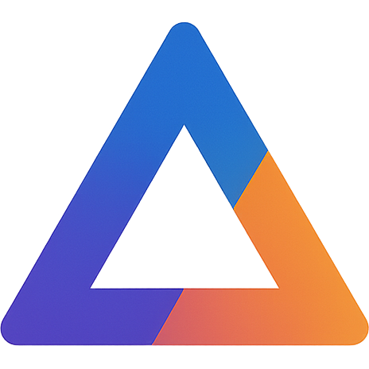

# UDEA

    

A Kotlin+LibGDX+Fleks game engine for 2D games.
    
## Features

- Many built-in components, streamlining creation of games.
- Networking, automatically syncs components across clients.
- A feature-rich asset system.
- An IDE plugin to create levels and assets.

## Modules

- **`comomon`** - Common code for the engine and plugin.
- **`level-editor`** - An embedded LibGDX level editor.
- **`idea-plugin`** - An IDE plugin for creating levels and assets.
- **`gradle-plugin`** - Gradle plugin for generated network code + DSL.
- **`example`** - Example game created with the engine.

## Contributing

Contributions are welcome! Please follow these steps:

- Fork the repository.

- Create a new branch for your feature or bugfix.

- Commit your changes and push the branch.

- Open a pull request.

## License
This project is licensed under the MIT License. See the LICENSE file for details.

## Contact
For questions or support, raise an issue on the project.

:rocket:
