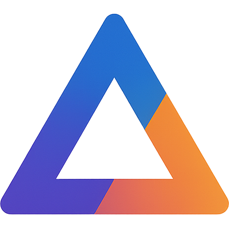

# UDEA

    

A Kotlin+LibGDX+Fleks game engine for 2D games.

## 📖 Documentation

Check out the [Udea Engine Documentation](docs/home.md) to get started!

## Features

- Many built-in components, streamlining creation of games.
- Networking, automatically syncs components across clients.
- A feature-rich asset system.
- An MCP tool surface on every game, so an agent can inspect and drive a running world.

## Modules

Udea is mid-rewrite. The `udea-*` tree is the engine being built; the modules below it are the
old tree, kept only until their replacements land. `AGENTS.md` has the full module table and the
dependency rules; `docs/migration/ledger.md` has the retirement order.

- **`udea-*`** - The rewrite. See `AGENTS.md`.
- **`moba`** - The 5v5 MOBA the engine is built against.
- **`common`** - Old engine core. Replaced module by module; deleted in Phase 6.
- **`gradle-plugin`** - Old codegen plugin. Replaced by `udea-gradle` + `udea-codegen` in Phase 6.
- **`example`** - Old example game. Replaced by `moba` in Phase 3. Dropping it from
  `settings.gradle.kts` is safe; **deleting its files is not**, because
  `scripts/stage-moba-art.py` stages `moba`'s character art out of
  `example/src/main/resources/assets/sprites/` and that is the only copy in the tree.

The level editor, the IDEA plugin and `compose-ui` were deleted in Phase 0: the tool surface is
the editor, so there is nothing to replace them with.

## Contributing

Contributions are welcome! Please follow these steps:

- Fork the repository.

- Create a new branch for your feature or bugfix.

- Commit your changes and push the branch.

- Open a pull request.

## License

The **code** is MIT. See [`LICENSE`](LICENSE).

The **art and audio are not**. Third-party sprite art from a paid asset pack is committed under
`example/src/main/resources/assets/sprites/`; `LICENSE` names it and excludes it explicitly, and
[`docs/art-assets.md`](docs/art-assets.md) records what is there, the options and the decision
taken. If you fork this repository, bring your own art.

`moba`'s copy of that art is **not** committed, so a fresh clone cannot build `:moba` until you
run `python3 scripts/stage-moba-art.py`. That step, and why the pixels are gitignored rather
than committed, are in [`docs/art-assets.md`](docs/art-assets.md).

## Contact
For questions or support, raise an issue on the project.

:rocket:
