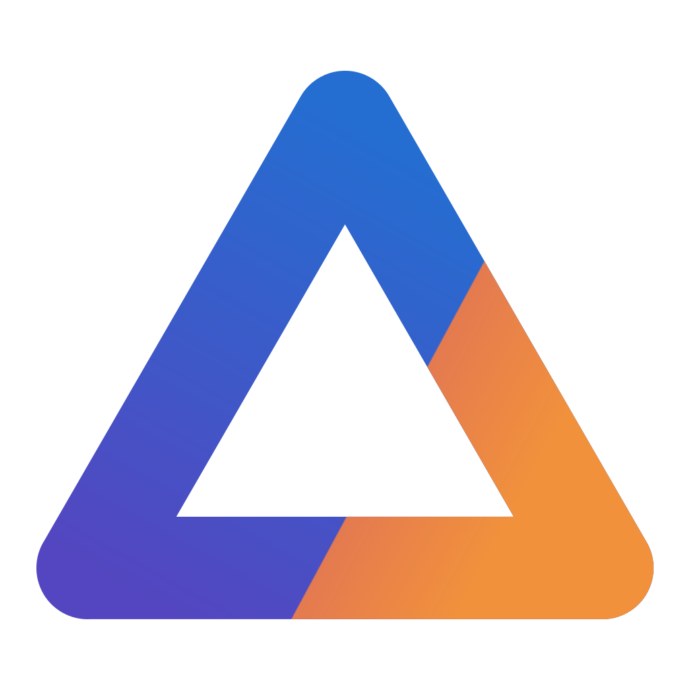

# UDEA

    

A Kotlin+Kool+Fleks game engine for 2D games.

## 📖 Documentation

Check out the [Udea Engine Documentation](docs/home.md) to get started!

## Features

- Many built-in components, streamlining creation of games.
- Networking, automatically syncs components across clients.
- A feature-rich asset system.
- An MCP tool surface on every game, so an agent can inspect and drive a running world.

## Modules

`AGENTS.md` has the full module table and the dependency rules.

- **`udea-*`** - The engine. See `AGENTS.md`.
- **`moba`** - The 5v5 MOBA the engine is built against.
- **`example-assets/`** - Not a module: the asset tree of the retired `example` game. `:moba`'s
  build stages its character art out of `example-assets/sprites/`, which is the only copy in the
  tree, and `udea-assets-compiler`'s tests read its asset scripts.

The previous engine - `common`, `gradle-plugin` and the `example` game - was deleted in issue
#213, once `moba` and the `udea-*` modules had replaced it. The level editor, the IDEA plugin and
`compose-ui` went earlier: the tool surface is the editor, so there is nothing to replace them
with.

## Contributing

Contributions are welcome! Please follow these steps:

- Fork the repository.

- Create a new branch for your feature or bugfix.

- Commit your changes and push the branch.

- Open a pull request.

## License

The **code** is MIT. See [`LICENSE`](LICENSE).

The **art and audio are not**. Third-party sprite art from a paid asset pack is committed under
`example-assets/sprites/`; `LICENSE` names it and excludes it explicitly, and
[`docs/art-assets.md`](docs/art-assets.md) records what is there, the options and the decision
taken. If you fork this repository, bring your own art.

`moba`'s copy of that art is **not** committed. There is no step to run: `./gradlew :moba:game:build`
stages it out of the copy this repository already holds, and leaves your checkout clean. Why the
pixels are gitignored rather than committed is in [`docs/art-assets.md`](docs/art-assets.md).

## Contact
For questions or support, raise an issue on the project.

:rocket:
