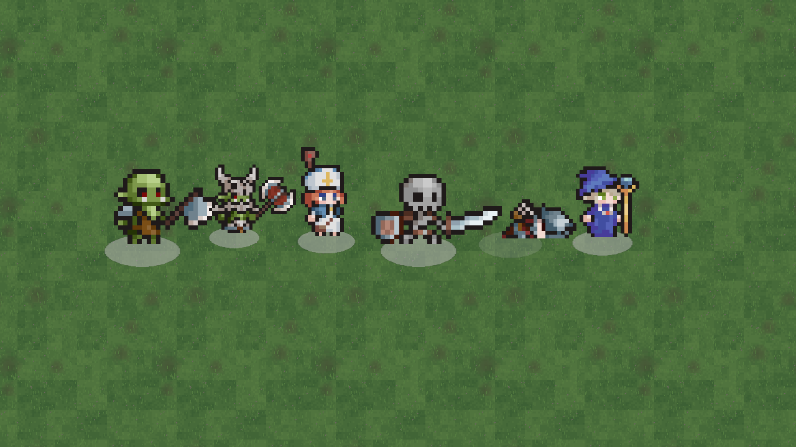

# Getting Started

There are two things you might want to do, and they are different. **Making a game with Udea** means
a repository of your own that resolves the engine as a library — you do not need a Udea checkout at
all. **Working on the engine**, or just looking at the example games, means cloning this repository
and building it.

This page covers both, with commands that work.

## Making a game

Your game is its own repository. It names one pinned engine version, and nothing in its build points
at a Udea checkout.

`templates/new-game/` in this repository is a working game of that shape. Copy it and it builds:

```sh
cp -r <udea>/templates/new-game ../my-game
cd ../my-game
gradle wrapper --gradle-version 8.13      # a wrapper of your own, once
./gradlew build
./gradlew run
```

`udeaVersion` in `gradle.properties` says which engine to build against, and everything else reads
it — the plugin ids, the module coordinates, the compiler plugin. Udea has no release yet, so that
is a pinned snapshot.

**`docs/new-game.md` in this repository is the full account**, and it is the one to read before the
first build: where the engine comes from, why the version is pinned rather than floating, how to get
a newer one, what each of the four files decides, and what the template does not cover yet. This
page does not repeat it.

One thing worth knowing up front, because it surprises everybody once: Gradle keeps a snapshot it
has already resolved for 24 hours. If a new snapshot was published under the same version number,
you need `./gradlew build --refresh-dependencies` to see it.

## Working on the engine

### What you need

- **JDK 21** to run Gradle. Gradle 8.13 does not run on JDK 25, and the failure is one line long —
  it prints the version number and nothing else. Point `JAVA_HOME` at a 21. The Kotlin toolchain
  inside the build is provisioned separately.
- **The Android SDK**, from `ANDROID_HOME` or an untracked `local.properties` containing
  `sdk.dir=...`. **Never commit `local.properties`.**
- **A GPU or a software GL driver**, if you want to run the graphical tests or see anything.
  Headless builds and tests are fine without one.
- **iOS builds only on macOS.** Off macOS, `./gradlew :<module>:allTests` skips the iOS targets; the
  `ios-tests` CI job runs them.

There is **no art step**. `moba`'s character sprites are licensed art that is not committed under
`moba/`, and `:moba:game:udeaStageCharacterArt` stages them out of `example-assets/sprites/` on
every build. A clone builds, and `git status` stays clean.

### Clone and build

```sh
git clone https://github.com/wildware-uk/Udea.git
cd Udea
./gradlew build
```

**No `-x` exclusions.** The repository is green, so any red task after your change is your change.

If the wrapper has lost its executable bit on your machine, run it as `sh gradlew build`. CI runs
`chmod +x ./gradlew` for the same reason.

`build` runs every gate: module arrows, determinism scans, frozen contracts, generated-file locks,
document checks. Each failure names a rule id. See [Build and Verification](Build-and-Verification).

## Running the examples

Two example games ship in the repository. `moba` is a 5v5 three-lane MOBA in 2D. Hollow is a
third-person 3D survival arena, and it is younger — see [Example Games](Example-Games).

### A window you can play

```sh
./gradlew playMoba        # gradlew.bat playMoba on Windows
./gradlew playHollow      # gradlew.bat playHollow on Windows
```

That is the one to start with. `playMoba` opens a visible window, single process, one world, no
networking: it is `:moba:desktop:play`, which is `runClient` in its default `local` mode.
`playHollow` is `:hollow:desktop:play`, which is Hollow's `run`. Use the per-game names from the
root: a bare `./gradlew play` matches the `play` task of *every* project and opens both games.

`runClient` takes a mode as its first argument. With none it is `local`.

| Command | What it does |
|---|---|
| `runClient --args=local` | Single process, one world, no transport. |
| `runClient --args=listen` | An authoritative session, with this window as its client over an in-process link. |
| `runClient --args="host 27015"` | Binds a **real UDP socket** and plays in this window as its first client. |
| `runClient --args="join 10.0.0.4:27015"` | Connects a real UDP socket to somebody else's `host`. |

An unrecognised mode is refused by name rather than falling back to single-player, because a player
who typed `joim 10.0.0.4` and got a local game with no error has no way to tell that from a server
that is down.

Hollow's equivalent opens a window and a listen server on UDP 27025 in one command:

```sh
./gradlew :hollow:desktop:run
```

Both take `-Plevel=<path>` for a level other than the default.

### The agent entry point, which is Offscreen

```sh
./gradlew :moba:desktop:run -PdebugPort=7841 --console=plain
```

**This does not open a window, and that surprises people.** `run` is the agent entry point. It
defaults to `RenderMode.Offscreen`: a real GL context with the window hidden, so screenshots work
but nothing appears on your screen. It is `run` rather than `runAgent` because that is the task name
the generated `gamebridge.json` invokes.

`-PdebugPort=N` puts the MCP tool surface on that port: `/health`, `/state`, `/command` and a
generated `/tools`. `moba` declares the port range `7840–7859`. `/health` reports the render mode,
so an agent knows which toolsets are live before calling one. See
[Agent Tool Surface](Agent-Tool-Surface).

If you want to watch a game rather than drive it, use `runClient` — that is what it is for.

### The dedicated server

```sh
./gradlew :moba:desktop:runServer      # moba, headless
./gradlew :hollow:desktop:runServer    # hollow, headless, UDP 27025
```

Headless: no GL context, no window, the identical simulation.

### The editor

```sh
./gradlew :moba:desktop:runEditor
```

Docked panels over the world, paused, with a Scene tab and a Game tab. The editor is a screen over
the same tool surface an agent calls, not a second implementation of it. See
[The Editor](The-Editor).

### Screenshots without a screen

These boot `Offscreen`, capture, and write PNGs. Each is run by name and never by `check`, because
each needs a GL driver.

| Command | What it writes |
|---|---|
| `:moba:desktop:runShot` | The character roster. |
| `:moba:desktop:runMatchShot` | Frames of a match in progress. |
| `:moba:desktop:runLaneShot` | The lane, creeps and towers. |
| `:hollow:desktop:runShot` | The lit clearing, to `-Pudea.shot.out=<png>`. |
| `:hollow:desktop:runPlayerShot` | The character standing, walking and running, one PNG per known tick. |



*What `:moba:desktop:runShot` produces.*

### Proving the network

```sh
./gradlew :moba:desktop:runNetProof    # one process: server plus two clients, three hashes that must agree
./gradlew :moba:desktop:runUdpProof    # three OS processes over real UDP
```

Both print a transcript, which is the point of running them.

## On a machine with no display

The graphical tests — `udeaGlTest`, `udeaAgentGlTest`, `udeaEditorGlTest` — are on `check`, but with
no display they **skip**, and the build stays green. That is the trap: a green build is not evidence
about graphics.

To run them for real under a virtual display with a software driver:

```sh
xvfb-run -a -s "-screen 0 1280x720x24" \
  env LIBGL_ALWAYS_SOFTWARE=1 GALLIUM_DRIVER=llvmpipe \
  ./gradlew udeaGlTest udeaAgentGlTest udeaEditorGlTest -Pudea.render.requireGl=true
```

`-Pudea.render.requireGl=true` turns a skip into a failure.

## Where to go next

- Making something: [Tutorial: Make a Game](Tutorial-Make-a-Game).
- Understanding the shape: [Architecture](Architecture), then
  [Tick Model and Determinism](Tick-Model-and-Determinism).
- Drawing: [Rendering with Kool](Rendering-with-Kool).
- Driving a running game: [Agent Tool Surface](Agent-Tool-Surface).

## See also

- [Architecture](Architecture)
- [Build and Verification](Build-and-Verification)
- [Example Games](Example-Games)
- [Rendering with Kool](Rendering-with-Kool)
- [The Editor](The-Editor)
- [Agent Tool Surface](Agent-Tool-Surface)
