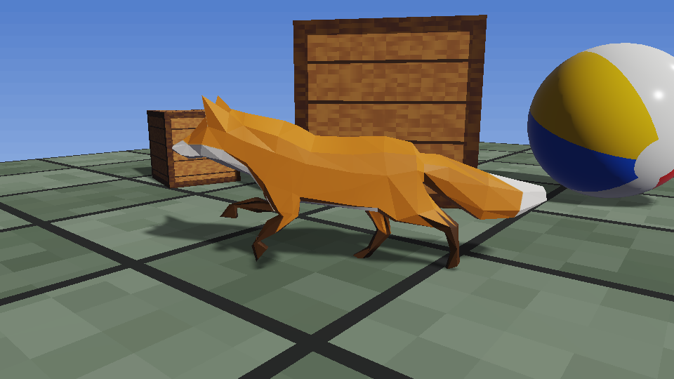
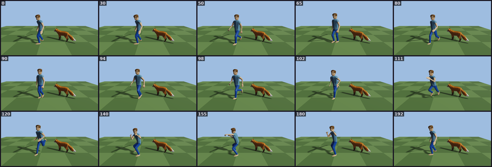

# Models and Animation

Udea draws 3D models with `ModelRenderSystem`, a render system in `udea-render`. A model is either a
built-in shape (box, sphere, plane) or a glTF or FBX file from the game's assets. Animation is split
in two: the simulation stores **which clip plays from which tick** in an `Animator` component, and
the renderer turns that into bones and a pose each frame.

The split works like a sheet of music and a musician. The `Animator` is the sheet: "play Walk from
tick 120". Every machine reads the same sheet, so every machine agrees. The renderer is the musician
who plays it, smoothly, at whatever frame rate it has.

## The pieces

| Piece | Module | What it is |
|---|---|---|
| `Transform3D` | `udea-core` | Where an entity sits in 3D: nine plain floats. Replicated. |
| `Animator` | `udea-core` | Which clip plays, from which tick, how fast, and any crossfade. Replicated. |
| `AttachedTo` | `udea-core` | A part mounted on a named node of another entity's model. Replicated. |
| `AnimationClip` | `udea-core` | One clip. Generated per model as `Fox.Clips.Walk`. |
| `ModelNode` | `udea-assets` | One named node. Generated per model as `Chassis.Nodes.socket_roof`, and listed on the model asset as `Model.nodes`. |
| `ModelExtras` | `udea-assets` | What the artist typed into Blender's Custom Properties: `Model.extras`, `ModelNode.extras`. |
| `ModelRenderer` | `udea-render` | What to draw on an entity. Never snapshotted or replicated. |
| `ModelRenderSystem` | `udea-render` | Draws every entity with a `ModelRenderer`. |
| `ModelCamera`, `ModelLight` | `udea-render` | The 3D camera, and one sun plus ambient light. |

## Transform3D: Z is up

`Transform3D` (`udea-core/src/commonMain/kotlin/dev/wildware/udea/core/spatial/Transform3D.kt`) holds
`x`, `y`, `z`, `rotationX`, `rotationY`, `rotationZ`, `scaleX`, `scaleY` and `scaleZ`. All are plain
floats and all are `@Net`, so a client sees a 3D entity move (issue #246).

**Z is up.** The ground is the plane `z = 0`, the same plane a 2D game lives on. A 2D point `(x, y)`
is the 3D point `(x, y, 0)`, and `rotationZ` is the heading. Rotations are radians, applied about X,
then Y, then Z.

To have it snapshotted, rewound and replicated, a game puts `Transform3D.snapshotType()` in its
`ComponentRegistry`. This is Hollow's whole registry
(`hollow/game/src/commonMain/kotlin/dev/wildware/hollow/net/HollowNet.kt`):

```kotlin
internal fun registry(): ComponentRegistry = ComponentRegistry(
    listOf(
        Player.snapshotType(),
        Animator.snapshotType(),
        Transform3D.snapshotType(),
    ),
)
```

`Transform3D` also carries the editor's handle annotations, so a selected model gets 3D move, turn
and scale handles. See [Gizmos](Gizmos). Ground-plane physics can drive it too; see
[Physics](Physics).

## Putting a model on an entity

This is from `moba`'s editor source set, which puts an animated Fox beside the player when you run
`sh gradlew :moba:desktop:runEditor -PeditorFox=true`
(`moba/desktop/src/editor/kotlin/dev/wildware/moba/editor/MobaEditorModels.kt`):

```kotlin
val model: Model = MobaAssets.registry[GameAssets.models.fox]
val fox: ImportedModel = loadModel(Path.of(root), model)

val entity = host.world.entity {
    it += Transform3D(x = x, y = y, rotationZ = FOX_HEADING, scaleX = FOX_SCALE, scaleY = FOX_SCALE, scaleZ = FOX_SCALE)
    it += ModelRenderer(model = fox)
    it += Animator().apply { play(Fox.Clips.Survey, host.ctx.clock.tick) }
}
netIds.allocate(entity)
```

- `loadModel(assetRoot, model)`
  (`udea-render/src/jvmMain/kotlin/dev/wildware/udea/render/model/ModelFiles.kt`) reads the glTF file
  under the asset root. It is JVM-only today.
- `ModelRenderer(model)` takes a `ModelSource`: an `ImportedModel`, or a `MeshModel` built from a
  `ModelMesh` and a `ModelMaterial`:

```kotlin
ModelRenderer(ModelMesh.box(1f, 1f, 1f), crate)   // from ModelRenderer's KDoc
```

`ModelMesh` has `box(sizeX, sizeY, sizeZ)`, `sphere(radius, steps = 32)` and `plane(sizeX, sizeY)`.
`ModelMaterial` takes an `albedo` texture, `roughness` (default `0.5`, 0 is a mirror and 1 is chalk)
and `metallic` (default `0`). Materials are compared by identity, so make one and share it.

## Registering the renderer

`ModelRenderSystem` is a normal `RenderSystem`. Hollow registers it in `RenderPhase.World`
(`hollow/game/src/commonMain/kotlin/dev/wildware/hollow/render/HollowScene.kt`):

```kotlin
registry.register(RenderPhase.World, { resources -> ModelRenderSystem(resources, camera, light) })
```

Its constructor is
`ModelRenderSystem(resources, camera: ModelCamera, light: ModelLight, lift: PoseSource? = null)`.

Where an entity is drawn:

- **With a `Transform3D`:** there. Position and heading are interpolated between the last two ticks
  at the render alpha when the game runs `RenderModule` (issue #246). Pitch, roll and scale are drawn
  as they stand.
- **Without one, but with `lift`:** a 2D pose `(x, y, angle)` from the `PoseSource` is drawn at
  `(x, y, 0)`, turned `angle` about Z, at scale 1. That is how a 2D game shows a 3D model with no 3D
  data.
- **With neither:** not drawn.

### Camera and light

`ModelCamera` is a perspective camera, in world units, Z up. Its fields are `eyeX/Y/Z`,
`targetX/Y/Z`, `fovYDegrees` (default 45), `near` (0.1) and `far` (100).
`lookAt(x, y, z, targetX, targetY, targetZ)` sets eye and target together. Moving the camera is
writing a field; the system reads it every frame.

`ModelLight` is one directional light that casts shadows, plus a uniform ambient light:
`directionX/Y/Z` (the direction the light travels), `color`, `intensity` (default 3), `ambient`, and
`shadowDistance` (default 25 world units). Shadows are drawn out to `shadowDistance` from the
camera; a shorter distance gives sharper shadows.

For a follow camera that sits behind a moving model, see [Cameras](Cameras).

## How the 3D pass works

`ModelStage` holds Kool's side of it
(`udea-render/src/commonMain/kotlin/dev/wildware/udea/render/model/ModelStage.kt`):

- One 3D render pass with a depth buffer and a perspective camera.
- One directional light with Kool's shadow map.
- Built-in meshes drawn instanced, one instance list per mesh-and-material pair, on Kool's PBR
  shader.
- One scene node per imported model, made by Kool's glTF reader with the file's own materials. Each
  node has its own pose, so two foxes can play two clips.

The 3D pass is drawn into its own image, then `ModelRenderSystem` draws that image into the 2D batch,
full frame, at its place in the phase order. So a background drawn before it shows behind the models,
sprites drawn after it are on top, and a screenshot holds all of it.

`ModelRenderSystem` also reports each model's world box to the editor, so a model can be clicked
(`PickBounds`, issue #235).



*The glTF Fox part-way through a crossfade from Walk to Run, lit by `ModelLight` and casting a
shadow (issue #242).*

## Model assets, typed clips and typed nodes

A model is declared in a `.udea.kts` asset script. These are `moba`'s two
(`moba/game/assets/models/fox.udea.kts`, `moba/game/assets/models/human.udea.kts`):

```kotlin
model(name = "fox", file = "models/fox/Fox.glb")
model(name = "human", file = "models/human/Human.fbx")
```

The asset build reads each model's file and generates one object per model in
`dev.wildware.udea.generated`, holding two things:

- **`Clips`** — one `AnimationClip` per animation in the file: `Fox.Clips.Survey`, `.Walk`, `.Run`;
  `Human.Clips.Idle`, `.Walk`, `.Run`, `.Punch`. `Fox.Clips.all` lists them.
- **`Nodes`** — one `ModelNode` per *named* node in the file: `Chassis.Nodes.socket_roof` and the
  like. A file with no named node gets no `Nodes` object.

So a clip or a socket the file does not have is a name that does not compile, and nothing looks
either up by name at run time.

### Asking a model you hold

Code that names a socket uses `Chassis.Nodes.socket_roof`. Code that holds a model and asks what it
has - an editor listing sockets, a fitting rule checking sizes - reads the model asset itself
(issue #271):

```kotlin
val chassis: Model = registry[GameAssets.models.chassis]
val sockets = chassis.nodes.filter { it.name.startsWith("socket_") }
```

`Model.nodes` is the same list as `Chassis.Nodes.all`, node for node: the build reads the file once
and writes both. No game writes a table of its models' nodes.

### Custom Properties

Values an artist adds in Blender's **Custom Properties** panel travel with the model when it is
exported with the glTF exporter's **Custom Properties** box ticked (glTF calls them `extras`).
An object's properties are on its node, and the scene's on the model:

```kotlin
val module = registry[GameAssets.models.module]
val body = module.nodes.single { it.name == "module" }
val mass = body.extras.float("mass") ?: 1f
val size = body.extras.text("module_size")
val tier = module.extras.int("tier")
val socket = module.nodes.single { it.name == "socket_top" }
val fits = socket.extras.text("accepts") == size
```

The reads are `float`, `int`, `text`, `bool` and `floats` (a vector). A missing key is `null`; a key
holding another type fails with `ModelExtraTypeException`, because a mass typed as text is a
mistake worth hearing about. A property group becomes dotted keys, `fitting.slots`. A value that is
none of those - a list of names, say - is left out by the build.

Each `AnimationClip` has an `index` (its place in the file, and its identity on the wire), a `name`,
and a `length` in whole ticks. The build converts the file's seconds to ticks at 60Hz, rounding up,
so a clip played once is never called finished before its last keyframe.

A typo gets a suggestion from the K2 checker in `udea-compiler-plugin`
(`UdeaGeneratedMemberChecker`), under two rules: `UDEA0016` for a clip and `UDEA0018` for a node.
The checker recognises a clip object by its members being typed `AnimationClip` and a node object by
theirs being typed `ModelNode`, so it is silent on every other unresolved name. Listing a model's
nodes at run time (above) does not weaken this: naming one in code is still checked when it compiles.

### FBX

Kool reads only glTF. An `.fbx` in the assets is converted to one self-contained binary glTF by
`FbxConverter`
(`udea-assets-compiler/src/main/kotlin/dev/wildware/udea/assets/compiler/model/FbxConverter.kt`),
using Assimp through LWJGL (issue #244). It embeds every texture, compacts the buffer so the output
is the same bytes every time, and names each clip after its action: Blender's `HumanArmature|Walk`
becomes `Human.Clips.Walk`. Assimp runs in the asset compiler only; rule `UDEA-MG-013` keeps it off
every runtime classpath. See [Assets](Assets).

The conversion runs once, on purpose, and its output is committed beside the `.fbx` it was made
from - `moba/game/assets/models/human/Human.glb` beside
`moba/game/assets/models/human/Human.fbx` - and the build packs that committed file and never
converts. The reason is that LWJGL ships a different Assimp build for each platform, and the
Windows one turns the same `.fbx` into floats that differ from Linux's in their last bits - enough
to give Windows a different asset hash and break every recorded replay there. So:

- after changing an `.fbx` or a texture it names, run `./gradlew udeaWriteConvertedModels` on
  Linux x86_64 and commit the `.glb` it writes;
- `udeaVerifyConvertedModels` runs on `check`. On Linux x86_64 it converts again and fails with
  `UDEA0039` when the result is not the committed file, naming the writer; on any other platform
  it prints that it skipped, and why.



*The converted FBX human playing Idle, Walk, Run and Punch beside the Fox. Each tile is labelled
with its tick (issue #244).*

## The Animator API

`Animator` (`udea-core/src/commonMain/kotlin/dev/wildware/udea/core/spatial/Animator.kt`) is a
component. Its KDoc shows the calls:

```kotlin
animator.play(Fox.Clips.Walk, now)
animator.crossfade(Fox.Clips.Run, now, over = 6.ticks)
animator.play(Fox.Clips.Survey, now, loop = Loop.Once, speed = 1.5f)
if (animator.isFinished(now)) ...
```

- `play(clip, now, loop = Loop.Repeat, speed = 1f)`: plays a clip from tick `now`. Whatever was
  playing stops on this tick.
- `crossfade(clip, now, over: Ticks, loop, speed)`: blends the new clip in over `over` ticks. The old
  clip keeps its own start and speed and carries on moving while it fades out.
- `isPlaying(clip)`, `clipTime(now)`, `isFinished(now)`, `blendWeight(now)`: questions, answered from
  the fields and the tick you pass.
- `Loop.Once` stops on the last tick and reports `isFinished`. `Loop.Repeat` wraps forever.
- `speed` is clip ticks per simulation tick. `0` freezes the clip on its first frame. A negative,
  infinite or not-a-number speed throws.

`now` is an argument because a component has no clock. A system changing an animation already has
the tick it is running.

### Why it stores no time

An `Animator` never stores "how far into the clip". It stores the clip, its start tick, its speed and
its loop mode, and computes the position from the tick you ask about. So nothing accumulates, nothing
drifts, and a rewind or a late-joining client needs nothing extra. The arithmetic is done in `Double`
and stays exact for about 103 days of ticks (`ClipTimeExactnessTest`).

Every field is `@Net`, so a client plays the same clip from the same tick as the server.

## Skinning and the pose

`ModelRenderSystem` poses a skinned model from the entity's `Animator` each frame: the clip, the
position in it at the current tick **plus the render alpha**, and the crossfade weight. `ClipPose`,
internal to `udea-render`, is the one place a clip's ticks become seconds
(`clipTicks / SimClock.DEFAULT_TICK_RATE`). Skinning runs on the GPU.

- An entity with no `Animator` draws the bind pose.
- A model with no skin ignores its `Animator`.
- The pose depends only on the tick, the alpha and the `Animator`, so a replay draws the same frames
  at the same ticks.
- Each model's shadow is drawn in that model's own pose.

## Mounting a part on a socket

A turret in a chassis's roof socket, a wheel on its axle, a gun on the turret's own socket. The part
is an ordinary entity with its own `Transform3D` and its own model, plus an `AttachedTo` naming the
parent and the node (issue #260):

```kotlin
// mount
turret.configure { it += AttachedTo(chassis, Chassis.Nodes.socket_roof) }
// swap: the same socket, a different part
hijacked.configure { it += AttachedTo(jeep, Jeep.Nodes.socket_wheel_fl) }
// detach - an explosion - leaves a free entity where the part was
turret.configure { it -= AttachedTo }
```

`AttachedTo(parent, node, offsetX, offsetY, offsetZ, offsetRotationX, offsetRotationY,
offsetRotationZ)` is the constructor gameplay code uses. The offsets are the part's own place within
the socket: a muzzle pushed 0.2 forward, a wheel turned to face outwards.

Three things about it are worth knowing.

**The parent is a `NetId`, never a Fleks `Entity`.** A mount crosses snapshots, packets and tool
calls, which is what the entity-identity contract is about. A parent that cannot be resolved —
destroyed, or not yet relevant to this client — leaves the part exactly where it last stood.

**The simulation and the renderer answer the socket slightly differently, on purpose.**
`AttachmentSystem` (`udea-core`, registered by `CoreModule` at `SimPhase.PostPhysics`) writes the
part's `Transform3D` every tick from the parent's transform, times the socket's **rest** place in the
parent's model, times the part's own offset. So everything that reads a world position — gameplay, a
level save, an agent tool — reads a real one. `ModelRenderSystem` then draws the part at the parent's
socket **as the parent is drawn this frame**, so a module on a walker's shoulder rides the moving
shoulder. A part whose parent is not drawn as an imported model this frame falls back to its
`Transform3D`, so a mount is never a reason for a part to vanish.

The rest transform is copied onto `AttachedTo` rather than looked up. Ten floats on the component
means the part's place is a pure function of what the snapshot already holds, and the headless
simulation needs no model catalogue of its own.

**A part can carry sockets of its own.** A gun on a turret on a chassis resolves parent-first, so the
whole assembly is correct within one tick whatever order the family iterates in.

Every field is `@Net` and nothing changes tick to tick, so a delta carries the mount once, in the
create, and nothing afterwards. `AttachedTo` is `@Serializable` too, so a level file saves an
assembled unit like anything else.

## In the editor

The editor's Animation panel lists the selected entity's clips, plays one on it, and scrubs a preview
in the Scene tab without touching the world. `BoneOverlayGizmo` can draw the skeleton. See
[The Editor](The-Editor).

## See also

- [Rendering with Kool](Rendering-with-Kool) — phases, the capture point, the render thread.
- [Assets](Assets) — `.udea.kts`, the asset build, generated accessors.
- [Cameras](Cameras) — `ModelCamera` and the third-person follow rig.
- [Replication and Networking](Replication-and-Networking) — how `Transform3D` and `Animator` reach clients.
- [Gizmos](Gizmos) — dragging a `Transform3D` in the editor.
- [Example Games](Example-Games) — Hollow, the 3D game.
