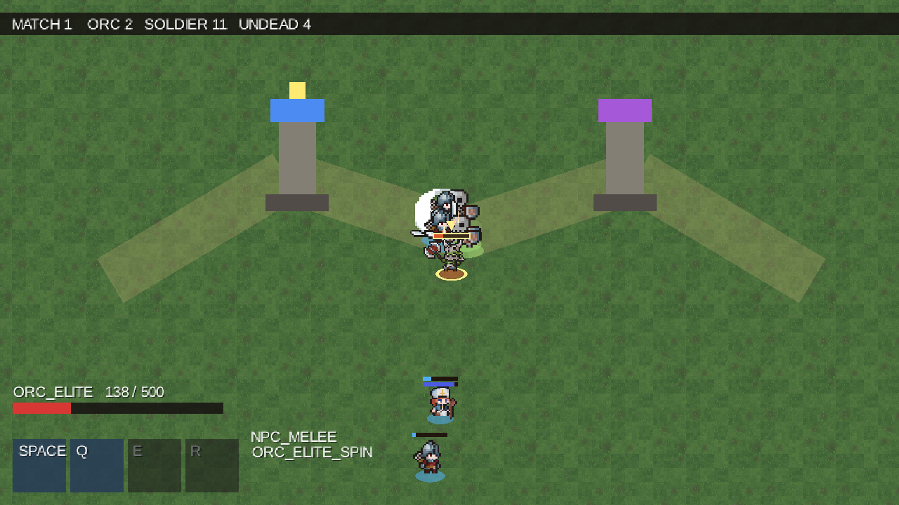

# UI with ComposeGL

Menus, HUDs and editor panels in Udea are written with ComposeGL (`dev.wildware.composegl`), a
Compose-style toolkit that draws through the GPU. A game writes a `UiScreen` — one `@Composable`
function — and never names a GL call.

There are two places a screen can be shown, and they answer opposite questions. A **`UiLayer`** draws
into the window *after* the frame an agent captures, so no screenshot ever sees it: that is a menu.
A **`CapturedUi`** draws *into* that frame, so every screenshot has it: that is a HUD.

Think of a television broadcast. The scoreboard burned into the picture goes out to every viewer —
that is a `CapturedUi`. The producer's controls in the gallery do not — that is a `UiLayer`. Which
one you are looking at is a fact about two different video feeds, not about who remembered to switch
something off.

## Writing a screen

```kotlin
public interface UiScreen {
    @Composable
    public fun content()
}
```

That is the whole of what a game implements. Inside `content()` you use the toolkit's own widgets —
`Column`, `Row`, `Box`, `Text`, `Spacer`, and modifiers like `padding`, `background`, `fillMaxWidth`.
`moba`'s HUD (`moba/game/src/commonMain/kotlin/dev/wildware/moba/MobaHudScreen.kt`) is a plain
composition of those.

A project that writes a screen applies `dev.wildware.udea.compose-ui` beside its Kotlin convention:
that is the Compose compiler, and without it a screen compiles as a plain function and fails only
when the toolkit composes it. `udea-render`, `udea-editor` and `moba:game` apply it, and so does a
game in its own repository (issue #275, `docs/new-game.md` under "Menus and a HUD").

A game may depend on `composegl-ui`, the toolkit with no backend in it, and on nothing else from
ComposeGL. The frontend that turns the tree into triangles — `composegl-kool` — is `udea-render`'s
alone, and `UDEA-MG-002` fails the build if a game reaches for it.

A `UiScreen` is **not** a `RenderSystem`. A render system is handed a batch and draws into the frame.
A screen is composed, laid out and drawn by the toolkit. Where it lands is decided by what shows it.

## A menu: `UiLayer`

```kotlin
val fonts = DesktopFonts()
val ui = UiLayer(fonts, Size(1280f, 720f))
backend.show(ui)          // the backend owns it from here, and closes it
ui.show(PauseMenu())      // and `ui.show(null)` takes it away again
```

`UiLayer(fonts, design, policy = ScalePolicy.Fit)`. `design` is the size the screens are written at;
the window is fitted to it, so a screen is laid out once and looks the same on every window.

`show(screen)` is a plain setter and is safe from **any** thread: it writes Compose snapshot state,
and the composition that reads it still runs on the render thread. Everything else about a `UiLayer`
is render-thread only.

Why a capture never sees it: a `UiLayer`'s scene is added after `KoolSurface`'s own, so it lands in
the **window's** framebuffer, after the presented frame — never inside the offscreen pass every
`RenderSystem` draws into and every capture reads. So "the menu is not in the agent's screenshot" is
a fact about two render targets rather than an ordering rule somebody maintains. `GlUiLayerTest` pins
it in pixels.

## A HUD: `CapturedUi`

A HUD is the other kind. An agent that takes a screenshot to see whether an ability is cooling needs
the cooldown in the picture, exactly as a player needs it on the screen. So it goes in the captured
frame.

You do not construct one. You ask a `RenderResources` for it, from inside a `RenderSystem`:

```kotlin
class HudSystem(resources: RenderResources, fonts: UiFonts) : RenderSystem {
    private val ui = resources.capturedUi(fonts)
    init { ui.show(HudScreen(state)) }
    ...
}
```

It draws into a second view of the capturable pass, added on top. Kool renders a pass's views in
order into one framebuffer, so by the time this view is reached every `RenderSystem` has already
drawn, and the toolkit's frame lands on the whole picture. It is above every render system in every
phase **by construction**, because it is a view drawn after the batch rather than a point in the
batch.

It is not a texture drawn back through the sprite batch, and that is deliberate: the toolkit
composites premultiplied colour while the batch blends straight alpha, so every translucent panel
would come out darker than the toolkit meant.

**A `CapturedUi` reads no input.** Nothing in it listens to a pointer or a key. A HUD shows state;
input reaches the simulation through `IntentState` and nothing else. A screen that wants to be
clicked is a `UiLayer`'s.



*The bar across the top, the health bar and the four ability boxes are a `CapturedUi`, so they are in
the screenshot. Everything the agent narrates about itself is not.*

### Keeping the numbers testable

`moba` splits its HUD in two, and it is worth copying. `HudState` is a value object of plain fields —
health, mana, cooldown remaining — refilled in place once per frame by a model that reads the world.
`MobaHudScreen` is the composition that draws it.

The point is that `MobaHudTest` drives a real `GameHost` with no GL context and asserts on the
numbers a human would read off the screen. The drawing code is then the only untested part, and it
draws nothing it was not handed.

The system samples in `render`, before Kool draws the pass the interface lands in, so the box and the
number in it describe the same tick as the world under them:

```kotlin
override fun render(target: OffscreenTarget, alpha: Float) {
    model.sample()
    screen.refresh()
}
```

One thing `moba` deliberately does not use: ComposeGL's ready-made `Hotbar` with its
`RadialCooldown`. A `Hotbar`'s cooldown is a timer the *interface* owns and counts down on its own
clock, so it would keep counting through a `time.rewind`. `moba`'s cooldown is read off the effect
actually on the unit. A second clock is exactly what the model exists to avoid.

## Fonts

Both kinds need a `UiFonts`, and **a screen with no text still needs one**: the toolkit samples solid
colour from the atlas's white block, so a panel of flat colour is drawn through the fonts as surely
as a label is. An atlas with nothing registered refuses to prepare, and says so.

```kotlin
DesktopFonts().use { fonts ->
    fonts.register("default", File("DejaVuSans.ttf").readBytes(), listOf(16, 24))
    backend.show(UiLayer(fonts, Size(1280f, 720f)))
}
```

Every size a screen draws at has to be registered, because faces are rasterised before the first
frame rather than during one.

`UiFonts` is abstract with an `internal` constructor, so `udea-render` supplies every implementation.
`DesktopFonts` is the desktop's, over stb_truetype; Android's glyphs come from its own `Typeface`
inside `composegl-kool`. Making an atlas means naming a rasteriser, and a rasteriser is a frontend.

Because a game module is common code that cannot name `DesktopFonts`, `moba` takes its HUD fonts as a
lambda from the launcher: `MobaScene.build(definition, hudFonts)`. The pipeline owns them from then
on — registered with `RenderResources.own` **before** the interface that draws with them, so
reverse-order release closes them after it.

## Who gets the key

A key a menu took never becomes an intent. `KoolKeyboard` offers each event to the `UiLayer` first
through `onKey`, and only what comes back `false` reaches the game's bindings. A text field with
focus eats the letters; a panel with an `onKeyEvent` eats Escape. Nothing shown means nothing taken,
so closing a menu puts every key back in the game's hands with no other state to unwind.

Pointers work the same way, through `KoolPointer`. See [Input](Input).

Mouse *motion* is the exception: it is not held back for a verdict, because a pointer moving across a
button is not a click on it.

## The render thread

Everything that composes, lays out or draws happens inside Kool's frame, on Kool's render thread.
`UiLayer.onKey` goes straight to the toolkit's key router and focus manager, none of which is
thread-safe — and it is safe only because `KoolThread` configures Kool with `asyncSceneUpdate =
false`, so input polling, the frame callbacks and the scene drawing are one thread.
`GlKoolInputTest` asserts that identity.

`show(...)` on either kind is the deliberate exception, and is safe from any thread.

## The editor is the same toolkit

`udea-editor` builds its docked panels out of `UiLayer` over the same `UiScreen` interface
(`moba/desktop/src/editor/kotlin/dev/wildware/moba/editor/MobaEditor.kt` shows a game wiring one up).
That is why an editor panel is never in a `render.screenshot`: it is in the window's framebuffer,
like any other menu. See [The Editor](The-Editor).

## See also

- [Rendering with Kool](Rendering-with-Kool) — the capture point and why overlays are excluded.
- [Input](Input) — first refusal on keys and clicks.
- [The Editor](The-Editor) — docked panels over the same toolkit.
- [Agent Tool Surface](Agent-Tool-Surface) — what a screenshot does and does not contain.
- [Architecture](Architecture) — `UDEA-MG-002` and why ComposeGL frontends stay in `udea-render`.
